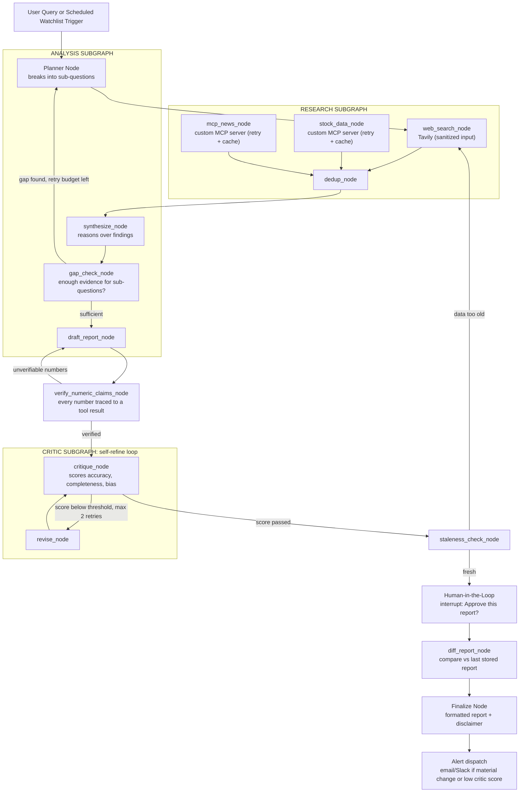

# ResearchPilot

**A multi-agent AI research analyst that watches your companies/sectors, tells you only what changed, and never hands you a confident wrong number.**

ResearchPilot researches a stock, market, or any topic — on demand or on a schedule — critiques and refines its own findings through a self-improvement loop, verifies every number it states against real source data, and produces a polished report. A human approval gate sits before anything is finalized.

---

## Why this exists

Most single-agent research tools do one of two things badly: dump raw search results with no synthesis, or produce confident-sounding analysis that's quietly wrong — a real problem in finance, where a single bad number is a real failure, not a cosmetic one.

ResearchPilot is built around **separation of concerns** across three agents:

- A **Research agent** that only gathers evidence, never reasons over it
- An **Analysis agent** that only reasons over gathered evidence, never invents it
- A **Critic agent** that scores the analysis for accuracy, completeness, and bias before it ever reaches a human

On top of that: every number in a report has to trace back to an actual tool call, not model memory; a human has to approve before anything ships; and the whole thing can run standing — watching a saved list of tickers/topics and telling you only what's new since last time, instead of making you ask the same question over and over.

---

## What it does

- **On-demand research:** ask a question (typed or voice), get a verified, human-approved report
- **Standing research:** save entities to a watchlist, get a scheduled re-run with a delta-only summary of what changed
- **Self-refining analysis:** a critic agent scores each draft and sends it back for revision if it's weak, up to a bounded retry cap
- **Numeric grounding:** every stated number (price, ratio, %, date) is cross-checked against the tool result it claims to come from — unverifiable numbers block the report, they don't ship with a caveat
- **Staleness protection:** if approval happens too long after data was pulled, the system re-fetches before letting a report through
- **Prompt-injection defense:** fetched web/news content is treated as untrusted data, never as instructions, and is explicitly delimited before it reaches any prompt
- **Human-in-the-loop, for real:** approval is a genuine paused-and-persisted graph state (LangGraph `interrupt()`), not a fake confirmation click — you can kill the backend mid-approval and it resumes correctly
- **Alerting:** get pinged (email/Slack) only when a scheduled run finds a material change or the critic flags a low-confidence report

---

## Architecture



Research, Analysis, and Critic are each built as their own **independently compiled LangGraph subgraph** with their own internal state schema, composed into a parent graph — not a flat node list. Each subgraph is independently testable, which is deliberate: it mirrors how production agent systems are actually modularized.

---

## Design decisions worth knowing about

**Numeric grounding is fail-closed.** `verify_numeric_claims_node` doesn't just check numbers against source data — if verification itself errors for any reason, the number is treated as *unverified*, never silently passed through. A finance agent that fails open on its own safety check isn't a safety check.

**Untrusted content is never treated as instructions.** Everything pulled from `web_search_node` and the news MCP tool is stripped of instruction-like patterns and wrapped in an explicit `<untrusted_source>` delimiter at the prompt-template level before it reaches any LLM call. This is a deliberate security decision, not an afterthought — most agent portfolio projects skip it entirely.

**The self-refine and re-planning loops are both bounded.** The Critic's revise loop and the Analysis subgraph's gap-check-triggered re-planning both carry a hard retry cap tracked in graph state, so a stubborn low-quality draft or an unanswerable sub-question can't spin the graph forever — it terminates with a best-effort result instead.

**Human-in-the-loop is a real graph interrupt, not a UI trick.** The approval node uses LangGraph's `interrupt()` with a Postgres checkpointer, so execution genuinely pauses and persists — you can restart the backend process mid-approval and it resumes from exactly where it left off.

---

## Tech stack

| Layer | Choice |
|---|---|
| Orchestration | LangGraph (subgraphs + `interrupt()`) |
| LLM framework | LangChain |
| LLMs | Groq (Llama 3.3 70B) for research/routing, Gemini for analysis/synthesis |
| MCP | Custom MCP server (Python MCP SDK) + LangChain MCP client adapter |
| Web search | Tavily |
| Market/news data | yfinance + a free news API |
| Voice input | Groq Whisper |
| Caching | Redis (TTL cache keyed on `(tool, args)`) |
| Scheduling | APScheduler |
| Alerting | SMTP / Slack webhook |
| Auth | JWT |
| Backend | FastAPI (async) |
| Frontend | Next.js — live subgraph progress + approval UI |
| State persistence | PostgreSQL + LangGraph checkpointer |
| Observability | LangSmith |
| Eval | Custom `agent_eval.py` (stdlib + pytest) |
| Deployment | Docker + AWS EC2 (backend), Vercel (frontend) |

---

## Repo structure

```
research-pilot/
├── mcp-server/
│   ├── tools/                    # stock price, news, fundamentals
│   └── reliability/               # retry, circuit breaker, cache wrappers
├── backend/
│   ├── graph/
│   │   ├── research_subgraph.py
│   │   ├── analysis_subgraph.py   # includes gap_check_node
│   │   ├── critic_subgraph.py
│   │   ├── guardrails/
│   │   │   ├── verify_numeric_claims.py
│   │   │   └── staleness_check.py
│   │   ├── standing/
│   │   │   ├── watchlist.py
│   │   │   ├── diff_report.py
│   │   │   └── scheduler.py
│   │   ├── security/
│   │   │   └── sanitize_untrusted_content.py
│   │   └── parent_graph.py        # composes subgraphs + interrupt() + guardrail nodes
│   ├── auth/                       # JWT dependency, per-user scoping
│   ├── checkpointer/               # Postgres checkpointer setup
│   ├── eval/
│   │   ├── agent_eval.py
│   │   └── adversarial_eval_set.json
│   ├── cache/                      # Redis client wrapper
│   └── main.py                     # FastAPI app
├── frontend/                        # Next.js: live progress UI, approval UI, watchlist UI
├── artifacts/                        # eval results, cost/latency reports, versioned per week
├── docker-compose.yml
└── README.md
```

---

## Getting started

```bash
git clone <repo-url> && cd research-pilot
cp .env.example .env
# fill in GROQ_API_KEY, GOOGLE_API_KEY, TAVILY_API_KEY, NEWS_API_KEY, LANGCHAIN_API_KEY, etc.
docker compose up
```

This brings up Postgres, Redis, the FastAPI backend, and the Next.js frontend. Backend runs at `http://localhost:8000`, frontend at `http://localhost:3000`.

---

## Evaluation

Results are committed to `artifacts/`, never cherry-picked. Metrics tracked against a fixed eval set:

- **Adversarial critic catch-rate** — % of deliberately injected wrong numbers/fabricated claims caught by the Critic before reaching human approval
- **Numeric grounding pass rate** — % of finalized reports where every stated number traced to a verified tool result on first pass
- **Critic loop effectiveness** — % of reports needing revision, average iterations to pass threshold
- **Human approval rate** — % approved as-is vs. revised vs. rejected
- **Cache hit rate** — % of MCP tool calls served from cache vs. live API call
- **Diff signal rate** — % of scheduled watchlist runs that surfaced a material change vs. "no change"
- **Cost/latency per subgraph** — tracked via LangSmith

See `backend/eval/agent_eval.py` and `artifacts/` for the latest committed run.

---

## Roadmap

Confirmed future work, deliberately kept out of the core build so the initial timeline doesn't slip:

- Multi-topic comparative research ("compare Tesla vs Rivian") via parallel subgraph execution
- Source credibility scoring — weight findings by source reliability
- Follow-up Q&A chat over a finalized report's stored findings
- PDF export + scheduled email digest of watchlist activity
- Multi-language report output (Hindi/English/Hinglish)
- Expanded MCP server (SEC filings, earnings transcripts, options data) + exposing ResearchPilot itself as a callable MCP tool for other agents

---

## Status

Actively in development. Current stage: foundation + MCP server (Week 1 of the build plan).